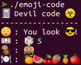

# C++ Emoji Source Code

Based on crazy developers.



See source code: [emoji-source-code.cpp](emoji-source-code.cpp)


## Compile & run code

```bash
make
./emoji-source-code
```

*Testet on Ubuntu 20.04.*
