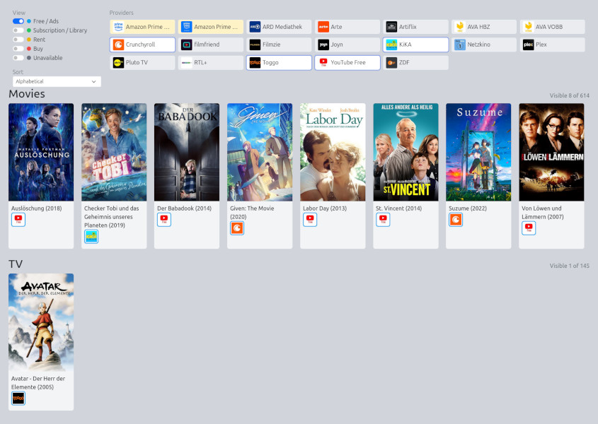

# Local TMDB Watchlist

[](example.jpg)

Download the [TMDB](https://www.themoviedb.org/) Watchlist of available streaming providers so you have a simplified overview of what is offered.

## Usage

* [TMDB Developer: Getting Started](https://developer.themoviedb.org/reference/intro/getting-started)

```bash
# One time: Add the TMDB v4 read access token to .env file
TMDB_APIKEY='Your API Key'

# Then allow account access. This stores .tmdb-auth.json locally.
./tmdb-local.py auth

# Save the current watchlist as movies.json.
./tmdb-local.py watchlist

# Update streaming providers separately.
./tmdb-local.py providers

# Optional: Generate static website
./create-static.py
```

## Configuration

Provider favorites and the blacklist can optionally be configured in `config.js`.

```js
const config = {
  providerFavorites: [8, 337],
  providerBlacklist: [35, 344],
};
```

## Convert to Markdown

```bash
FILENAME="movies_$(date '+%Y-%m-%d').md"

echo "## Movies\n" > "$FILENAME"
jq -r '.movies |= sort_by(.title) | .movies[] | "- [ ] [\(.title) (\(.year))](\(.url))"' movies.json >> "$FILENAME"

echo '' >> "$FILENAME"
echo "## TV\n" >> "$FILENAME"
jq -r '.tvs |= sort_by(.title) | .tvs[] | "- [ ] [\(.title) (\(.year))](\(.url))"' movies.json >> "$FILENAME"
```
